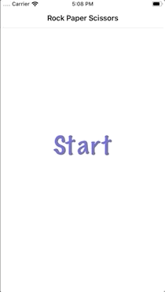

# RPS

This starter project will help you learn more about how navigation works in iOS.

The project is a Rock Paper Scissors game. 

It has 3 screens:
- Start screen
- Selecting an option, users should tap one of the three options
- Results screen. This screen shows the rival's choice and tells the user if they won. Also they can go back to the start or play again.

TODO:

1. Before we get into segues, embed the first ViewController in a UINavigation Controller: Editor->Embed in-> Navigation Controller
2. We want to go from the Start screen to the next. Use a segue and use the detail transition.
3. From the three buttons in the second screen we can get to the results. Use 3 different segues and give them an identifier, we'll use this later to know what the user selected. Use the modal transition in all of them.
4. Do an unwind segue that will get to the first VC when the user taps "Exit"
5. Do an unwind segue that will get to the second VC when the user taps "Play Again"
6. Complete the game logic to show the use if they won, lost or was a tie.

Gameplay

